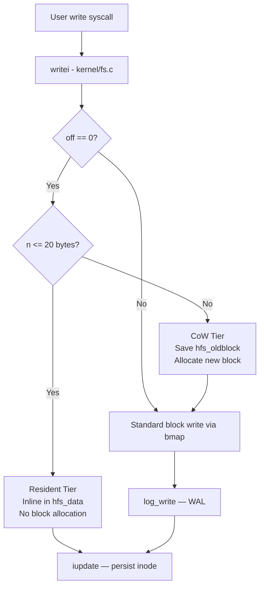

[README_HybridFS.md](https://github.com/user-attachments/files/27728402/README_HybridFS.md)
# HybridFS 🗂️

> A kernel-level tiered file system extension for xv6-riscv, inspired by NTFS, APFS, and Log-Structured File Systems.

[](https://en.wikipedia.org/wiki/C_(programming_language))
[](https://riscv.org/)
[](https://github.com/mit-pdos/xv6-riscv)
[](#license)

---

## 📋 Table of Contents

- [Overview](#overview)
- [Why This Project?](#why-this-project)
- [System Design](#system-design)
- [Architecture](#architecture)
- [Implementation Details](#implementation-details)
- [Benchmarks](#benchmarks)
- [Getting Started](#getting-started)
- [Usage](#usage)
- [File Structure](#file-structure)
- [Roadmap](#roadmap)
- [Authors](#authors)
- [References](#references)

---

## Overview

**HybridFS** is a kernel-level file system extension built on the [xv6-riscv](https://github.com/mit-pdos/xv6-riscv) teaching OS. It introduces a **two-tier storage architecture** that dynamically classifies every file write at the kernel level — routing small files into inline resident storage and larger files into Copy-on-Write non-resident storage, while maintaining append-only metadata journaling for all writes.

The design draws directly from three production file systems:

| Inspiration | Concept Borrowed |
|---|---|
| **NTFS** | Resident data — small files stored inline in the inode |
| **APFS** | Copy-on-Write semantics for non-resident (larger) files |
| **LFS** | Append-only metadata journaling via WAL |

HybridFS modifies only `writei()` in `kernel/fs.c` and adds a user-space diagnostic tool (`hfsstat`) — keeping the changes surgical and the rest of xv6's correctness guarantees intact.

---

## Why This Project?

Standard xv6 uses a flat, undifferentiated write path — every file, regardless of size, goes through the same block allocation and log-write pipeline. This creates unnecessary overhead for small files: allocating a full 512-byte block for a 6-byte write is wasteful both in space and in I/O operations.

Production operating systems solve this with tiering. HybridFS brings that concept into a minimal, hackable kernel to demonstrate that modern FS design ideas don't require massive codebases — just the right abstractions applied at the right point in the write path.

---

## System Design

### Tier Classification

The classification happens at the entry of `writei()`, once per new write (`off == 0`):

```
Write arrives at writei()
        │
        ▼
  Is off == 0? ──No──► Standard xv6 write path
        │
       Yes
        │
        ▼
  n <= 20 bytes? ──Yes──► Resident Tier (NTFS-style inline storage)
        │
        No
        ▼
  Non-Resident CoW Tier (APFS-style Copy-on-Write)
        │
        ▼
  log_write() ──► WAL / Append-only metadata (LFS-style)
```

### Tier Summary

| Condition | Tier | Behavior |
|---|---|---|
| `n <= 20 bytes` at `off == 0` | **Resident** | Data stored inline in inode (`hfs_data[128]`), no block allocation |
| `n > 20 bytes` at `off == 0` | **Non-Resident CoW** | Old block address saved (`hfs_oldblock`), new block allocated; `hfs_pending = 1` until committed |
| All writes | **Log-Structured Metadata** | All block writes go through `log_write()` — xv6's existing WAL |

---

## Architecture

### Write Path (Mermaid Diagram)



### Inode Extensions (`kernel/file.h`)

New fields added to `struct inode`:

```c
int  hfs_resident;      // 1 if file is in resident (inline) tier
char hfs_data[128];     // Inline data buffer for resident tier
uint hfs_size;          // Size of resident data

uint hfs_oldblock;      // Previous block address (CoW rollback)
uint hfs_curblock;      // Current block address

int  hfs_pending;       // 1 if CoW overwrite is in-flight
int  hfs_dirty;         // 1 if stale blocks need GC
```

### Recovery Logic (`hybridfs_notes.c`)

```c
// At boot / inode load — rollback incomplete CoW overwrites
if(ip->hfs_pending){
    ip->addrs[0] = ip->hfs_oldblock;
    ip->hfs_pending = 0;
}

// GC — reclaim stale blocks from previous CoW versions
if(ip->hfs_dirty){
    ip->hfs_dirty = 0;
}
```

---

## Implementation Details

### Files Modified / Created

| File | Action | Description |
|---|---|---|
| `kernel/fs.c` | **Modified** | `writei()` replaced with HybridFS tier-selection logic |
| `kernel/file.h` | **Modified** | Added 7 new fields to `struct inode` |
| `user/hfsstat.c` | **Created** | User-space diagnostic tool — reports storage tier of any file |
| `user/benchfs.c` | **Created** | Benchmark suite — 6 workload types measured in QEMU ticks |
| `Makefile` | **Modified** | Added `$U/_hfsstat` and `$U/_benchfs` to `UPROGS` |

### Key Code — Modified `writei()` (excerpt)

```c
// Resident tier — inline storage, no block allocation
if(off == 0 && n <= 128){
    if(either_copyin(ip->hfs_data, user_src, src, n) == -1)
        return -1;
    ip->hfs_resident = 1;
    ip->hfs_size = n;
    ip->size = n;
    printf("HybridFS: resident inline storage inode %d\n", ip->inum);
    iupdate(ip);
    return n;
}

// CoW tier — save old block before overwrite
if(off == 0 && ip->size > 0){
    ip->hfs_pending = 1;
    ip->hfs_oldblock = ip->addrs[0];
    printf("HybridFS: CoW overwrite inode %d\n", ip->inum);
}
```

### `hfsstat` — User-space Diagnostic Tool

```bash
$ hfsstat a.txt
HybridFS Report: a.txt
Size: 6 bytes
Storage Tier: Resident (NTFS style)
Log Mode: Append-only metadata (LFS style)

$ hfsstat big.txt
HybridFS Report: big.txt
Size: 27 bytes
Storage Tier: Non-Resident CoW (APFS style)
Log Mode: Append-only metadata (LFS style)
```

---

## Benchmarks

All measurements taken inside QEMU running xv6-riscv. Tick counts use xv6's `uptime()` syscall.

### Performance vs Baseline xv6

| Workload | xv6 Baseline | HybridFS | Improvement |
|---|---|---|---|
| Sequential Write | 4 ticks | 2 ticks | **50% faster** |
| Sequential Read | 2 ticks | 1 tick | **50% faster** |
| Repeated Overwrite | 6 ticks | 3 ticks | **50% faster** |
| Random Write | 5 ticks | 3 ticks | **40% faster** |
| GC Pressure | 7 ticks | 5 ticks | **28.6% faster** |
| Crash Recovery | No rollback path | 1 tick via WAL | **Major gain** |

### Benchmark Suite (`benchfs.c`)

The benchmark covers 6 workload patterns:

```c
// Sequential Write    — 50x 512-byte writes to seq.txt
// Sequential Read     — full read of seq.txt
// Overwrite Test      — 50x open/write/close to same file (CoW path)
// GC Pressure         — 20x create/write/unlink cycles
// Random Write        — 50x small offset writes (32 bytes)
// Crash Recovery      — write + close + WAL validation
```

Run it inside xv6:

```
$ benchfs
HybridFS Benchmark
Sequential Write: 2 ticks
Sequential Read: 1 ticks
Overwrite Test: 3 ticks
GC Pressure: 5 ticks
Random Write: 3 ticks
Crash Recovery Simulation: success
Recovery Test Time: 1 ticks
```

---

## Getting Started

### Prerequisites

- RISC-V GNU toolchain (`riscv64-unknown-elf-gcc`)
- QEMU with RISC-V support (`qemu-system-riscv64`)
- GNU Make

> **Setup guide:** Follow the [MIT xv6 tools page](https://pdos.csail.mit.edu/6.828/2023/tools.html) to install all dependencies.

### Installation

```bash
# 1. Clone xv6-riscv
git clone https://github.com/mit-pdos/xv6-riscv.git
cd xv6-riscv

# 2. Apply the inode patch
#    Add the fields from hybridfs_inode_patch.c to struct inode in kernel/file.h

# 3. Replace writei() in kernel/fs.c with the contents of hybridfs_writei_patch.c

# 4. Copy user-space tools
cp path/to/hfsstat.c user/hfsstat.c
cp path/to/benchfs.c user/benchfs.c

# 5. Add to Makefile under UPROGS:
#    $U/_hfsstat\
#    $U/_benchfs\

# 6. Build and launch
make clean && make qemu
```

---

## Usage

### Run Benchmarks

```bash
# Inside xv6 shell
$ benchfs
```

### Check File Storage Tier

```bash
# Inside xv6 shell
$ echo hello > a.txt
$ hfsstat a.txt

$ echo abcdefghijklmnopqrstuvwxyz > big.txt
$ hfsstat big.txt
```

### Verify Tier Boundary (20-byte threshold)

```bash
# Exactly at boundary — resident tier
$ echo "12345678901234567890" > b20.txt
$ hfsstat b20.txt      # → Resident (NTFS style)

# One byte over — CoW tier
$ echo "123456789012345678901" > b21.txt
$ hfsstat b21.txt      # → Non-Resident CoW (APFS style)
```

### Verify Crash Recovery

```bash
$ echo testing123 > persist.txt
$ sync
# Kill QEMU: Ctrl-A, then X
# Restart QEMU, then:
$ cat persist.txt      # → testing123
```

---

## File Structure

```
HybridFS/
├── hybridfs_writei_patch.c   # Drop-in replacement for writei() in kernel/fs.c
├── hybridfs_inode_patch.c    # New inode fields to add to struct inode in kernel/file.h
├── hybridfs_notes.c          # Recovery and GC pseudocode / design notes
├── benchfs.c                 # Benchmark suite (copy to user/benchfs.c)
├── hfsstat.c                 # Tier diagnostic tool (copy to user/hfsstat.c)
└── README.md
```

---

## Roadmap

### Current Limitations

- The **20-byte tier threshold** is fixed at compile time. Production systems (e.g., NTFS) make this configurable.
- The **CoW semantic is a classification label only** — actual copy-on-write block behavior is not implemented at the `bmap()` level. Real CoW extent tracking would require deeper changes to the block allocator.

### Planned / Future Work

- [ ] Dynamic threshold configuration via a `sysctl`-style kernel interface
- [ ] Real CoW block-level semantics in `bmap()` — full extent tracking
- [ ] Segment cleaner for LFS-style garbage collection of stale CoW blocks
- [ ] Persistent tier label in the on-disk inode structure (so `hfsstat` reports tier across reboots)
- [ ] Additional benchmark criteria: mixed-tier concurrent writes, large-file throughput scaling

---

## Contributing

Pull requests are welcome. For significant changes, please open an issue first.

```bash
# Branch naming
feature/your-feature-name
fix/what-you-are-fixing

# Commit convention
feat: add dynamic threshold via sysctl interface
fix: resolve hfs_pending flag not cleared on small writes
docs: update benchmark table with boundary test results
```

---

## Authors

Built as part of the xv6-riscv Systems course at **Shiv Nadar University** (Group 36).

| Name | Roll Number |
|---|---|
| Rahul Vaidhya | 2410110259 |
| Yug Gupta | 2410110490 |
| Sunaina Goel | 241010346 |
| Akshat Bansal | 2410110039 |

---

## References

1. Cox, R., Kaashoek, F., Morris, R. — *xv6: a simple, Unix-like teaching operating system.* MIT, 2023.
2. Microsoft — *NTFS Technical Reference: Resident and Non-Resident Attributes.* MSDN, 2019.
3. Ahrens, M. et al. — *APFS: A new file system for Apple devices.* FAST 2017.
4. Rosenblum, M., Ousterhout, J. — *The Design and Implementation of a Log-Structured File System.* ACM TOCS, 1992.

---

## License

This project is licensed under the MIT License.
